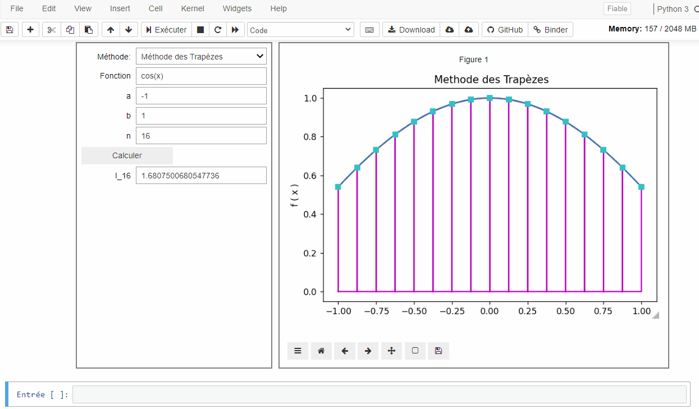

# TP3: Intégration numérique 
- [Introduction](#Introduction)
- [Les methodes simples d'intégration numérique](#Les_methodes_simples_d'intégration_numérique)
     - [Formule des trapèzes](##Formule_des_trapèzes)
     - [Formule de Simpson](##Formule_de_Simpson) 
     - [Formule de quadratures](##Formule_de_quadratures)
     
- # Introduction 
L'integration est un des problemes les plus importants que l'on rencontre en analyse. En effet, on
rencontre souvent des integrales dont le calcul par des methodes analytiques est tres complique
ou meme impossible, car il n'existe pas d'expression analytique d'une primitive de la fonction
à integrer.
Le but de ce chapitre est d’aborder le calcul général de l’intégrale d’une fonction f(x) sur un domaine
fini délimité par des bornes finies a et b

- ## Les methodes simples d'intégration numérique
L'intégration numérique est un chapitre important de l'analyse numérique et un outil indispensable en physique numérique. 
On intègre numériquement dans deux cas principaux :

               * On ne peut pas intégrer analytiquement,
               * L'intégrande est fourni non pas sous la forme d'une fonction mais de tableaux de mesures.
            
Les méthodes numériques d'intégration d'une fonction sont nombreuses et les techniques très diverses.

- ### Formule des trapèzes
- 

